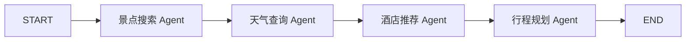

# TripGraph

基于 LangGraph 的多 Agent 智能旅行助手。后端使用 FastAPI，前端由 FastAPI 直接提供，不需要安装 Node.js。

## 保留的功能

- 目的地、日期、交通、住宿、旅行偏好和额外要求
- 景点搜索、天气查询、酒店推荐、行程规划四个 Agent
- 每日 2～3 个景点、三餐、酒店、交通、天气和预算
- 与参考项目一致的概览、预算、地图、每日行程和天气区域
- 每日行程使用折叠面板，一次展开一天
- 高德地图只展示当前选中日期的景点，并按游览顺序连接
- 编辑、保存、取消、景点排序和删除
- 导出图片和 PDF
- 景点图片查询

本项目不包含参考项目之外的需求分析 Agent、餐饮搜索 Agent、质量审核 Agent、
审核回路、Agent 执行记录、按天标签页或步行/驾车/公交道路导航。

## LangGraph 工作流



四个 Agent 按参考项目的顺序执行，并由 LangGraph 保存和传递共享状态。景点 Agent
先用高德关键词搜索获取 POI ID，再查询 POI 详情补齐地图坐标。餐饮信息由行程规划
Agent 作为每日计划的一部分生成，与参考项目一致。

## 项目结构

```text
.
├─ app/
│  ├─ graph/
│  │  ├─ agents.py       # 四个 Agent 的实时与演示实现
│  │  ├─ state.py        # LangGraph 最小共享状态
│  │  └─ workflow.py     # StateGraph 节点与边
│  ├─ services/
│  │  └─ mcp_maps.py     # 高德 MCP 客户端
│  ├─ static/
│  │  ├─ index.html
│  │  ├─ app.js
│  │  └─ styles.css
│  ├─ config.py
│  ├─ main.py
│  └─ models.py
├─ tests/
├─ .env.example
├─ DEPENDENCIES.md
├─ requirements.txt
├─ requirements-dev.txt
└─ run.py
```

## 环境要求

- Python 3.11 或 3.12
- 可访问 PyPI 的网络环境
- Node.js、数据库和 Docker 均不是必需项

## 首次安装

在 Windows PowerShell 中执行：

```powershell
py -3.11 -m venv .venv
.\.venv\Scripts\Activate.ps1
.venv/Scripts/python.exe -m pip install --upgrade pip
.venv/Scripts/python.exe -m pip install -r requirements.txt
```

根据需要编辑 `.env`，然后启动：

```powershell
.venv/Scripts/python.exe run.py
```

后续再次运行时，不需要重新创建虚拟环境或安装依赖：

```powershell
.venv/Scripts/python.exe run.py
```

保持窗口运行，浏览器打开：

- 页面：<http://127.0.0.1:8000>
- API 文档：<http://127.0.0.1:8000/docs>
- 健康检查：<http://127.0.0.1:8000/health>

停止服务时，在运行窗口按 `Ctrl+C`。

## 实时模式配置

`.env` 中需要：

```dotenv
DEMO_MODE=false

LLM_API_KEY=你的大模型密钥
LLM_BASE_URL=https://api.openai.com/v1
LLM_MODEL=gpt-4.1-mini

AMAP_API_KEY=你的高德Web服务Key
AMAP_MCP_URL=https://mcp.amap.com/mcp

AMAP_JS_KEY=你的高德Web端JS_API_Key
AMAP_JS_SECURITY_CODE=对应的安全密钥

UNSPLASH_ACCESS_KEY=可选的Unsplash_Access_Key
```

- `AMAP_API_KEY` 供 Python 后端通过高德 MCP 查询景点、酒店和天气。
- `AMAP_JS_KEY` 必须选择高德“Web端（JS API）”，供浏览器加载地图。
- 只体验规划流程时可以使用 `DEMO_MODE=true`；展示真实地图仍需配置 JS API Key。
- 修改 `.env` 后要停止旧服务并重新运行；页面使用 `Ctrl+F5` 强制刷新。

## API

参考项目的旅行规划接口：

```http
POST /api/trip/plan
```

请求示例：

```json
{
  "city": "杭州",
  "start_date": "2026-08-01",
  "end_date": "2026-08-03",
  "travel_days": 3,
  "transportation": "公共交通",
  "accommodation": "经济型酒店",
  "preferences": ["历史文化", "美食"],
  "free_text_input": "每天不要安排得太满"
}
```

响应只包含与参考项目一致的 `success`、`message` 和 `data`。

## 验证

```powershell
$OutputEncoding = [Console]::OutputEncoding = [Text.UTF8Encoding]::new($false)
Set-Location -LiteralPath "D:/TripGraph"
.venv/Scripts/python.exe -m pip install -r requirements-dev.txt
.venv/Scripts/python.exe -m pytest -q
.venv/Scripts/python.exe -m ruff check .
.venv/Scripts/python.exe -m pip check
```
