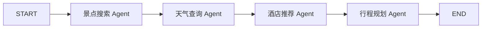

# TripGraph

基于LangGraph的多Agent智能旅行助手。后端使用FastAPI，前端由FastAPI直接提供，不需要安装Node.js。

## 功能

- 目的地、日期、交通、住宿、旅行偏好和额外要求
- 景点搜索、天气查询、酒店推荐、行程规划四个 Agent
- 每日 2～3 个景点、三餐、酒店、交通、天气和预算
- 每日行程使用折叠面板，一次展开一天
- 高德地图只展示当前选中日期的景点，并按游览顺序连接
- 编辑、保存、取消、景点排序和删除
- 导出图片和 PDF
- 景点图片查询

## LangGraph 工作流



四个Agent按参考项目的顺序执行，并由LangGraph保存和传递共享状态。景点Agent先用高德关键词搜索获取POI ID，再查询POI详情补齐地图坐标。餐饮信息由行程规划Agent作为每日计划的一部分生成，与参考项目一致。

## 项目结构

```text
.
├─ app/
│  ├─ graph/
│  │  ├─ agents.py       # 四个 Agent 的实时与演示实现
│  │  ├─ state.py        # LangGraph 最小共享状态
│  │  └─ workflow.py     # StateGraph 节点与边
│  ├─ services/
│  │  └─ mcp_maps.py     # 高德 MCP 客户端
│  ├─ static/
│  │  ├─ index.html
│  │  ├─ app.js
│  │  └─ styles.css
│  ├─ config.py
│  ├─ main.py
│  └─ models.py
├─ tests/
├─ .env.example
├─ requirements.txt
└─ run.py
```

## 环境要求

- Python 3.11 或 3.12

## 首次安装

PowerShell中创建虚拟环境并安装依赖

```powershell
py -3.11 -m venv .venv
.\.venv\Scripts\Activate.ps1
.venv/Scripts/python.exe -m pip install --upgrade pip
.venv/Scripts/python.exe -m pip install -r requirements.txt
```

创建并编辑 `.env`，然后启动：

```powershell
.venv/Scripts/python.exe run.py
```

保持窗口运行，浏览器打开：

- 页面：<http://127.0.0.1:8000>
